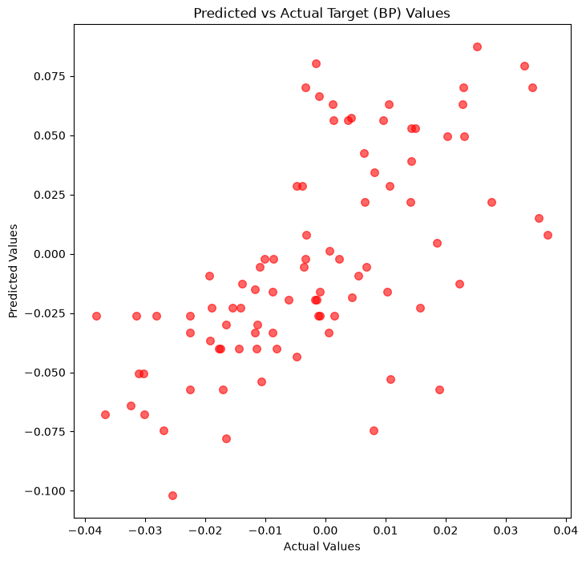
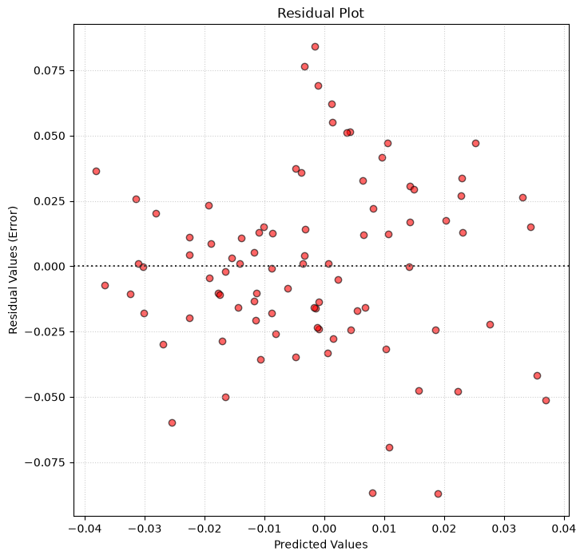
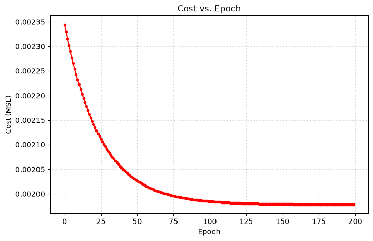
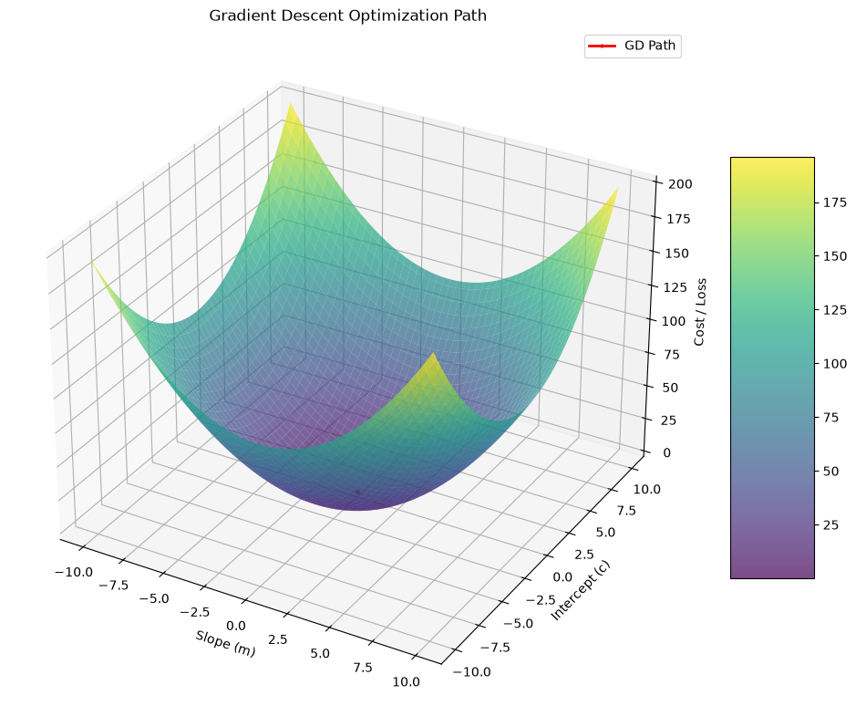

# 📉 Diabetes Gradient Descent

A machine learning project that implements **Linear Regression using Gradient Descent from Scratch** on the Scikit-learn Diabetes dataset, with an interactive **Streamlit application** for visualizing the optimization process.

## Features

- Linear Regression using `SGDRegressor`
- Custom `GradientDescent.py` implementation
- Feature scaling with `StandardScaler`
- MAE, MSE & R² evaluation
- Interactive Streamlit dashboard
- 3D optimization and convergence visualizations

## Project Structure

```text
DIABETES-GD/
│
├── app.py
├── GradientDescent.py
├── main.ipynb
├── plots/
├── requirements.txt
└── README.md
```

## Visualizations

### Predicted vs Actual



### Residual Plot



### Cost vs Iteration



### 3D Gradient Descent Optimization



## Tech Stack

- Python
- NumPy
- Pandas
- Matplotlib
- Scikit-learn
- Streamlit

## Run Locally

```bash
pip install -r requirements.txt
streamlit run app.py
```

## Learning Outcomes

- Implemented Gradient Descent from scratch
- Compared it with Scikit-learn's `SGDRegressor`
- Understood feature scaling and regression evaluation
- Visualized optimization through cost curves and a 3D loss surface

*The Streamlit application was built with the help of GPT.*